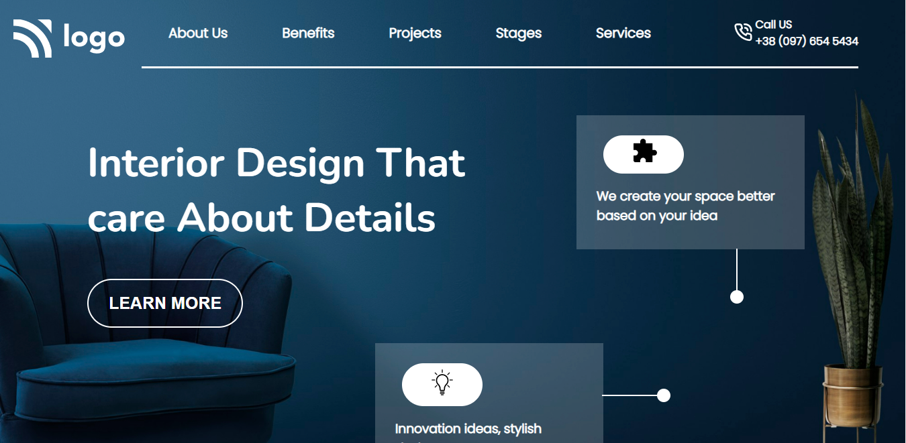
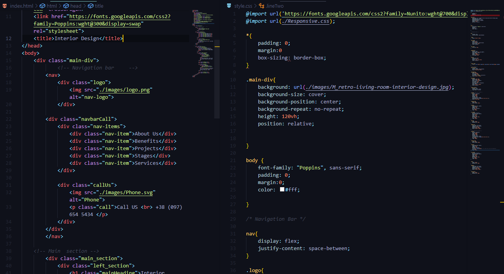
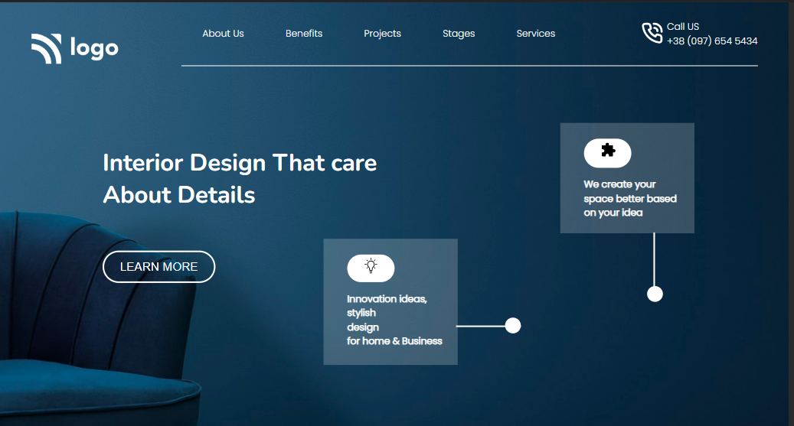
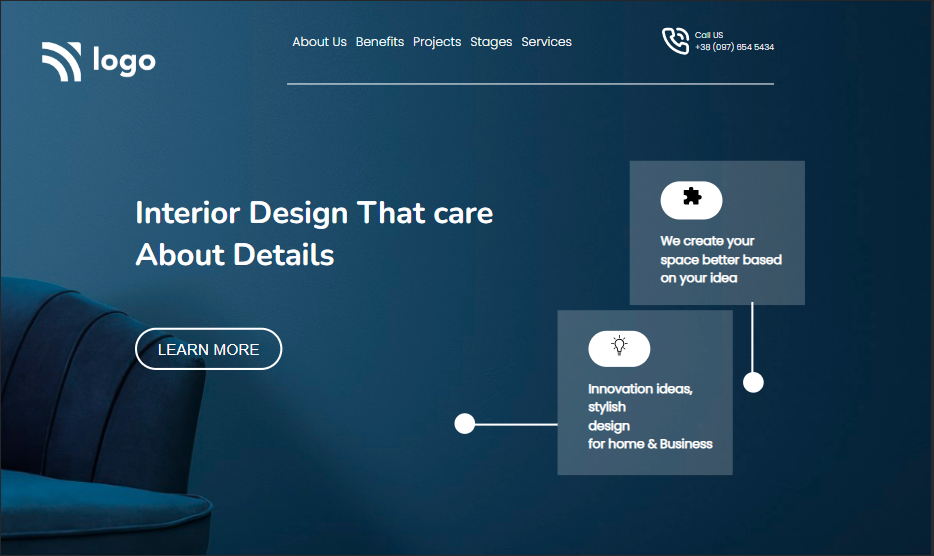
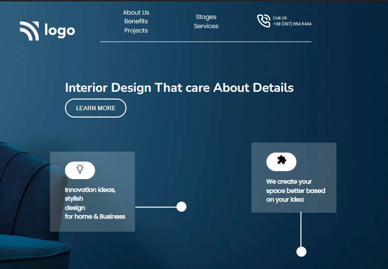
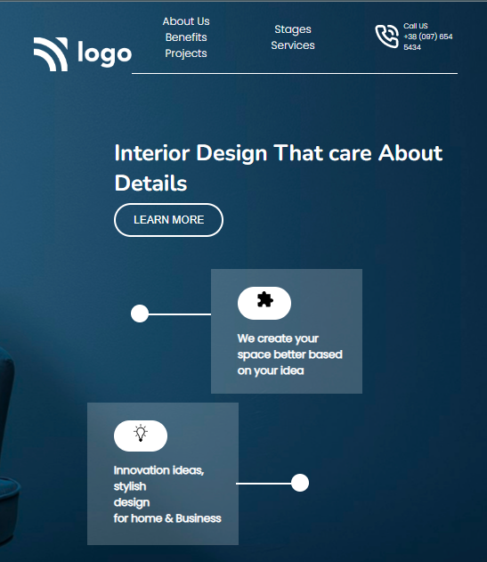

# Interior Design Template : Tenth Website in pure HTML and CSS

---

## Description
This is a landing page designed for an Interior design firm in pure HTML and CSS. The overall design is minimal with basic information and buttons. All the elements and colors used here are of pastel form. Arrangements of the navbar and main section including left and right were done using `Flexbox` and its various properties. The overall time taken was around `5-7 hours` which I gave in multiple sittings. 
My initial hours were dedicated to writing the HTML segments where I declared all the precious elements like the navbar, main sections, images, and icons. Selecting the correct icons and their size according to the color scheme was one task for me. Later on, most of my time was consumed in detailing of every object and maintaining their responsiveness for the devices of all screen sizes. 
 
Apart from that designing the transparent cards on the website was another challenge during the development. That transparent card uses icon images and I had to invert the colors of the icons so that they can fit into the transparent cards. These challenges were handled by using the `filter property` and `transform` of CSS image. The main CSS was somehow manageable but making it responsive took some extra hours. This project has trained me more on `Flexbox`, `media queries, `image`, properties along with designing aspects.

---

 

## About The Project

Here's a Screen-Shot of my 10th project along with the code snippets.

 

 

 

 

 

<!-- PROJECT LOGO -->
 

  

<h3 align="center">project 10 - Interior Design</h3>
  
   
    <a href="https://interiordesign-project10.netlify.app/">View Live Demo</a>
  

## Built With

**Using Technologies**

1. `HTML`
2. `CSS`
3. `MarkDown`

> The challenge of this project was to make the design responsive from scratch with pure CSS without using any frameworks .

 

## Live Project

This project is presently deployed in **`Netlify Service`**.

[Live Project URL](https://interiordesign-project10.netlify.app/)
 

<!-- LEARNT -->
 

## Learnt
In This project I learnt the following properties of HTML and CSS.
- In depth learning of Responsive designs.
- Flexbox and its Properties. 
- Media Queries.
- Image and Background Properties

 
<!-- CONTACT -->

## Contact

- **Name 👨‍💻:** [Harshal Verma](https://github.com/harshalvrm)
- **Email 📧:** [harshalvrm3@gmail.com](mailto:harshalvrm3@gmail.com)
- **Linkedln 📝:** [Click Here](https://www.linkedin.com/in/harshalvrm3/)
- **Blog 📝:** [Hashnode blog](https://xadai.hashnode.dev/)

 

[Project 10 Link](https://interiordesign-project10.netlify.app/) 

